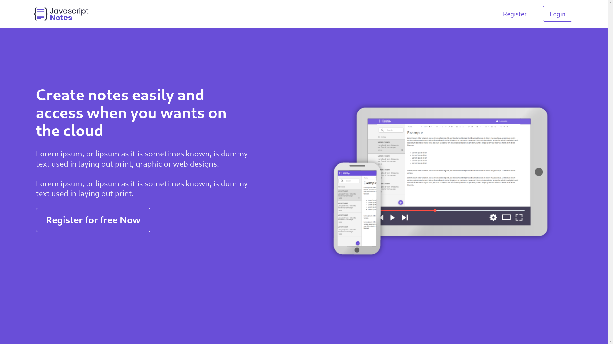
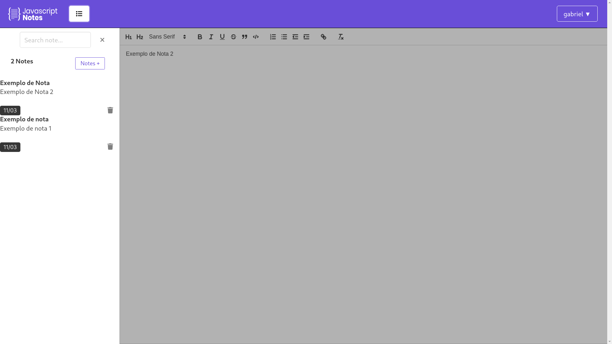
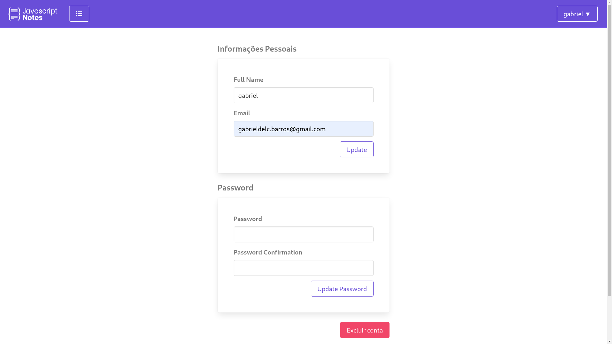

# Notepad

Notepad built using
[React](https://reactjs.org/)
on frontend and
[Node](https://nodejs.org/)
on backend.

Deployed on
[Heroku](https://heroku.com)
and
[Mongodb-atlas](https://mongodb.com/atlas/database)

##### [Demo](https://javascriptnotesfront.herokuapp.com/)
HOME                       |  Notes                    | Settings
:-------------------------:|:-------------------------:|:-------------------------:
        |        | 


## Run locally

```bash
git clone https://github.com/gabriel-del/JavascriptNotesClient && cd JavascriptNotesClient
yarn install
yarn run start
```

Backend:
[https://github.com/gabriel-del/JavascriptNotesApi](https://github.com/gabriel-del/JavascriptNotesApi)


## Learn how to do 

<a href="https://go.hotmart.com/P66380356P">

</a>

###### **Portuguese language

